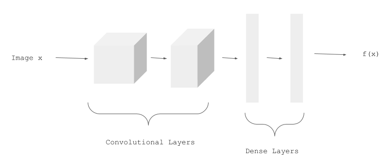
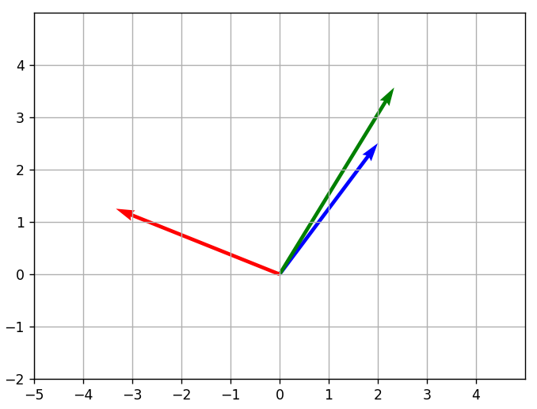
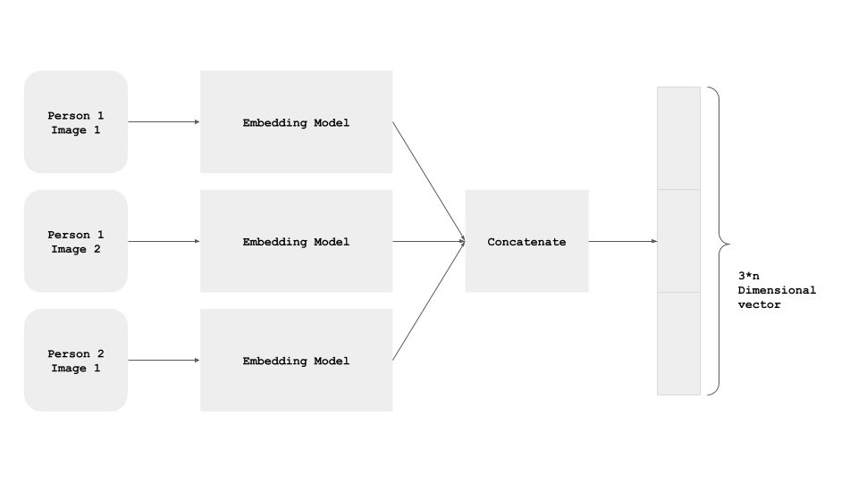

# Siamese-Network-with-Triplet-Loss-in-Keras

Siamese Neural Networks (SNNs) are a type of neural networks that contains multiple instances of the same model and share same architecture and weights. This architecture shows its strength when it has to learn with limited data and we don’t have a complete dataset, like in Zero / One shot learning tasks.

Traditionally, a neural network learns to predict over multiple classes. This poses a problem when we need to add / remove new classes to the data. In this case, we have to update the neural network and retrain it on the whole dataset. Also, deep neural networks need a large volume of data to train on. SNNs on the other hand learn a similarity function. Thus, we can train it to see if two images are the same (which we will do here). This enables to classify new classes of data without training the network again.

We have a CNN model called `EmbeddingModel`:

We use three images for each training example:
1. `person1_image1.jpg` (Anchor Example, represented below in green)
2. `person1_image2.jpg` (Positive Example, in blue)
3. `person2_image1.jpg` (Negative Example, in red).

## Siamese Network

All the three images of an example pass through the model, and we get the three Embeddings: One for the Anchor Example, one for the Positive Example, and one for the Negative Example.

The three instances of the `EmbeddingModel` shown above are not different instances. It's the same, shared model instance - i.e. the parameters are shared, and are updated for all the three paths simultaneously.

### MNIST Triplet

## Learnt Embeddings

