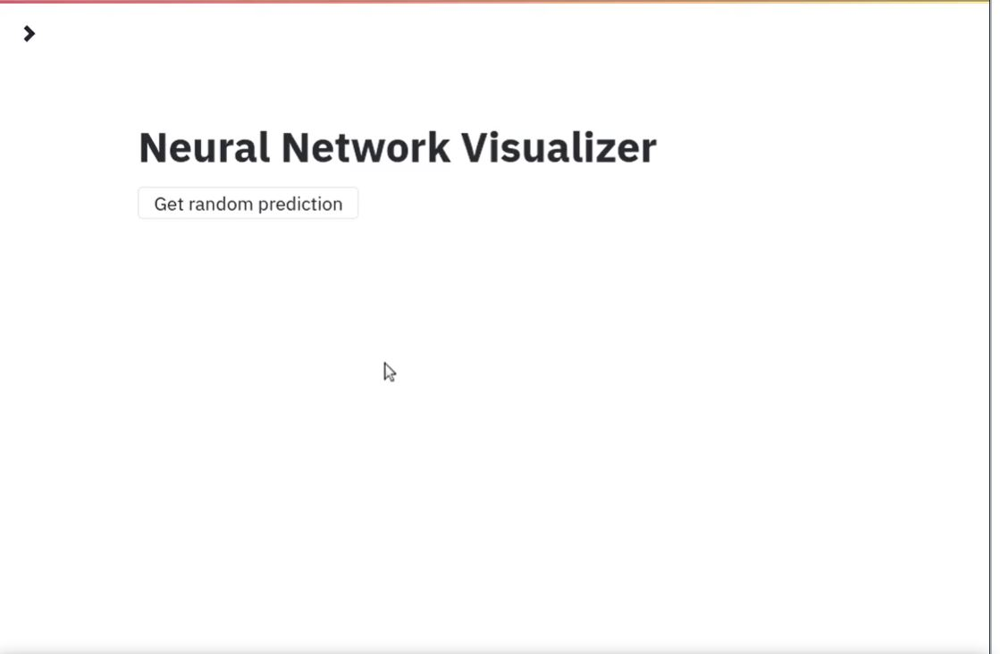
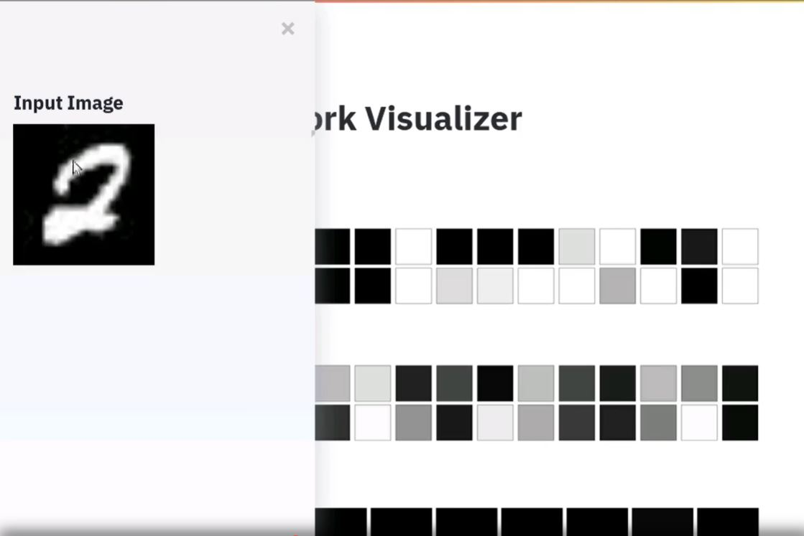
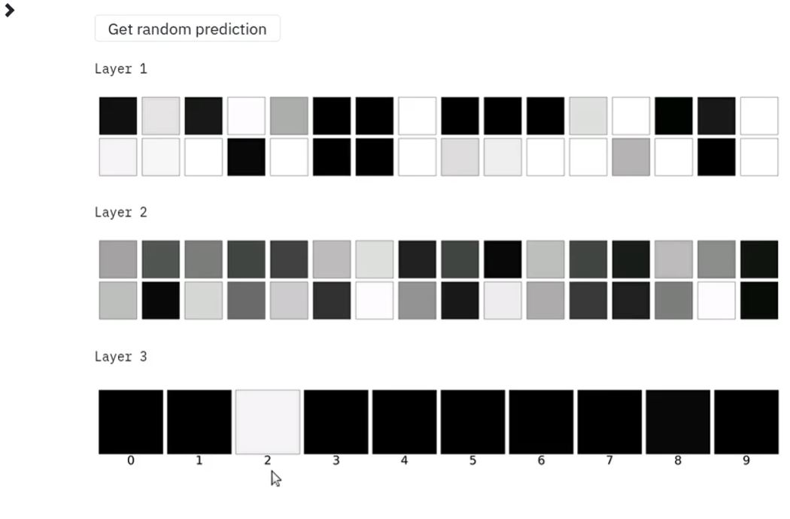

# NN-Visualizer-Web-App-using-Flask-and-Streamlit
Neural Network Visualizer Web App using Flask and Streamlit
### Home Page

  
  
### Viewing the number in Sidebar

  
  
  
### Output Visualization
 

  
